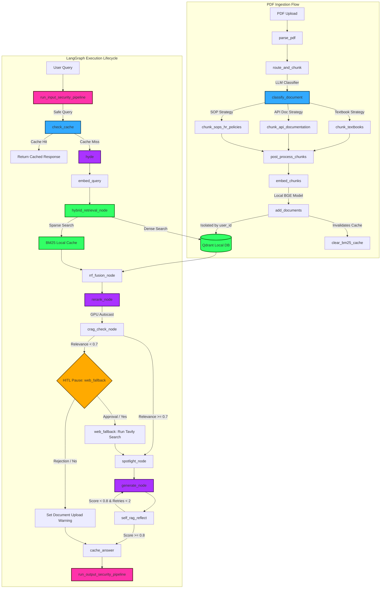

# ⚡ Enterprise RAG System Architecture Summary ⚡

Welcome to the comprehensive system documentation for the **Enterprise RAG System**. This document maps out every component, function, data flow, and caching pipeline, utilizing colors, emojis, and clear explanations.

---

## 🗺️ Mermaid Flowchart Diagram

Here is the complete dynamic request lifecycle showing how files, queries, and background processes flow through the system:



---

## 📂 File-Wise Function Mapping (with Hinglish Explanations)

This section maps all functions file-by-file with a detailed **Hinglish** translation of their operational roles:

### ⚙️ `config.py` — Settings and API Factories
*   **`get_llm_client()`**
    *   *Hinglish*: Yeh function NVIDIA NIM server ke liye OpenAI client initialize karta hai, jo deepseek-ai/deepseek-v4-pro model run karne ke kaam aata hai (jisme thinking mode disable kiya hua hai).
*   **`get_embedding_client()`**
    *   *Hinglish*: BGE local embedding models load karne se pehle variables load karta hai aur client instances manage karta hai.

### 🔑 `auth.py` — Supabase Auth Guard
*   **`get_current_user(token)`**
    *   *Hinglish*: Incoming HTTP Request se Bearer Token nikalta hai aur use Supabase ke JWKS endpoints se verify karta hai. Agar token galat ya expire ho gaya ho, toh 401 Unauthorized exception raise kar deta hai.

### 🛑 `rate_limiter.py` — Upstash Rate Limiter
*   **`rate_limit_dependency(user)`**
    *   *Hinglish*: Supabase authenticated `user_id` ke basis par check karta hai ki kisi user ne query limit exceed toh nahi ki. Agar Redis link offline ho, toh connection graceful degrade karke allow kar deta hai.

### 🛡️ `security.py` — Input/Output Guard Rails
*   **`run_input_security_pipeline(query)`**
    *   *Hinglish*: User query ko check karta hai SQL injection, prompt injection, toxicity aur dynamic PII leaks ke liye. Agar query unsafe lagti hai toh turant block response bhej deta hai.
*   **`run_output_security_pipeline(response)`**
    *   *Hinglish*: System output me se dynamic PII variables (email, phones, CC numbers) mask/redact karta hai taaki sensitive data public network pe leak na ho.

### 🧠 `cache.py` — Redis Two-Tier Cache Client
*   **`cache_key(prefix, text, user_id=None)`**
    *   *Hinglish*: Caching keys generate karne ke liye hash banata hai. Agar `user_id` diya ho toh key `prefix:user_id:hash` banti hai, jo users ke database cache data ko complete isolate rakhti hai.
*   **`get_cached_embedding(text)` / `set_cached_embedding(...)`**
    *   *Hinglish*: Mathematical embedding representations save karta hai. Yeh cache shared/global hota hai taaki common queries ke embeddings fast load ho sakein bina GPU recalculation ke.
*   **`get_cached_answer(query, user_id)` / `set_cached_answer(...)`**
    *   *Hinglish*: Caches answers isolated strictly by `user_id` so that Bob is never shown Alice's private answers, preventing data leaks.

### 📂 `ingestion.py` — Layout Ingestion Controller
*   **`parse_pdf(file, filename)`**
    *   *Hinglish*: PDF lines and sections stream load karta hai page markers (`[PAGE_X]`) inject karte hue taaki metadata coordinate extraction secure ho sake.
*   **`post_process_chunks(chunks, combined_text)`**
    *   *Hinglish*: Chunks me se internal page labels `[PAGE_X]` ko remove karta hai aur page index ko metadata structure mapping coordinates me mapping karta hai.
*   **`embed_chunks(chunks)`**
    *   *Hinglish*: Local `bge-small-en-v1.5` model se chunk content vectors calculate karta hai GPU mixed-precision features use karke.
*   **`ingest_pdf(file, filename, user_id)`**
    *   *Hinglish*: Ingestion workflow assemble karke final document index updates database and Qdrant local database me load karta hai.

### 📝 `chunking_strategies.py` — Document-Aware Chunker Hub
*   **`classify_document(sample_text)`**
    *   *Hinglish*: Ingested PDF ka sample text check karke LLM se poochta hai ki yeh category Textbooks, API documentation, ya SOP policies me se kaun si category me belong karta hai.
*   **`chunk_textbooks(...)`**
    *   *Hinglish*: Continuity mapping layout rules par textbooks divide karta hai. LaTeX blocks aur formulas protect karke 10-15% range overlap apply karta hai.
*   **`chunk_api_documentation(...)`**
    *   *Hinglish*: Code scripts or table limits parse karta hai. Prose content me 20% range overlap use karta hai jabki code blocks ` ``` ` me strictly 0% overlap use karta hai syntax break hone se bachane ke liye.
*   **`chunk_sops_hr_policies(...)`**
    *   *Hinglish*: Structural rules read karke Version numbers aur owner department metadata properties parse karta hai aur nodes ko 10% overlap limits par break karta hai.

### 🖥️ `models_local.py` — Local GPU Model Allocator
*   **`get_embedding_model()`**
    *   *Hinglish*: Local embedding generator model load karta hai local NVIDIA GPU par execution ke liye.
*   **`get_reranker_model()`**
    *   *Hinglish*: Local Cross-Encoder model allocate aur compile karta hai memory structure me.

### 🕸️ `rag_graph.py` — LangGraph Pipeline Engine
*   **`clear_bm25_cache(user_id)`**
    *   *Hinglish*: Kisi tenant ke dynamic BM25 cached corpus parameters clear karta hai jab woh naye documents index upload kare.
*   **`hybrid_retrieval_node(state)`**
    *   *Hinglish*: Localized BM25 sparse search and Qdrant dense vector search execute karta hai user query parameters par.
*   **`rerank_node(state)`**
    *   *Hinglish*: Retrieval candidates score karta hai local Cross-Encoder use karke GPU tensor mixed-precision autocast execution settings ke under.
*   **`web_fallback_node(state)`**
    *   *Hinglish*: Tavily client connection handle karta hai. Agar web search approve hua ho toh real-time data fetch karta hai; agar reject hua ho toh warning answer save kar deta hai.
*   **`route_after_web_fallback(state)`**
    *   *Hinglish*: Conditional edges handle karta hai. Agar user search parameters cancel kiye ho toh seedhe cache_answer node bypass karta hai generation and self_rag skip karke.

### 🌐 `main.py` — FastAPI Interface Gateway
*   **`lifespan(app)`**
    *   *Hinglish*: Application trigger hote hi checkpointer initialization setup execute karta hai autocommit support settings par connection pool parameters check karte hue.
*   **`resume_query(request, user)`**
    *   *Hinglish*: Paused checkpointer task queue fetch karke user verification values state config save database resume trigger dynamic workflow run karke complete answers details output deta hai.

---

## 📡 API Routes Reference

| Endpoint | Method | Security / Auth | Input Payload | Output / Response |
| :--- | :--- | :--- | :--- | :--- |
| `/signup` | **POST** | Public | `{email, password}` | `{message: "Signup successful"}` |
| `/login` | **POST** | Public | `{email, password}` | `{access_token, token_type}` |
| `/documents` | **POST** | Bearer JWT + Rate Limit | Multipart Form: File `.pdf` | `{status, filename, pages, chunks, message}` |
| `/query` | **POST** | Bearer JWT + Rate Limit | `{query}` | `RAGResponse` (200 OK) OR `{"status": "paused", "thread_id"}` (202 Accepted) |
| `/query/resume` | **POST** | Bearer JWT + Rate Limit | `{thread_id, approve, query}` | `RAGResponse` (200 OK) |
| `/me` | **GET** | Bearer JWT | None | `{user_id, email, ...}` |
| `/documents/count` | **GET** | Bearer JWT + Rate Limit | None | `{documents_indexed}` |
| `/` | **GET** | Public | None | `{status: "healthy", document_count}` |

---

## 🔬 Chunking, Caching, and Vector Storage Frameworks

### 🧩 1. The Rectified Chunking Strategies
During document upload, the first 1,500 characters are parsed and analyzed by the **LLM Document Classifier** (`DeepSeek V4 Pro`) to dynamically route the document to the optimal parsing strategy:
1.  **Textbooks Strategy**:
    *   *Overlap*: **10% to 15% sliding window overlap** to ensure conceptual continuity across page breaks.
    *   *Formatting*: Protects LaTeX equations ($ and $$) and code blocks.
2.  **API & Technical Documentation Strategy**:
    *   *Overlap*: **Strict 0% overlap inside code blocks** to prevent syntax loop corruption. **20% overlap** is maintained for surrounding explanatory text to preserve variables context.
3.  **SOPs & HR Policies Strategy**:
    *   *Overlap*: **10% overlap** heavily tied to pre-retrieval metadata filters.

---

### 🚀 2. Two-Tier Upstash Caching
*   **Embedding Cache (Tier 2)**: Checks if the user query was previously embedded. Uses Upstash Redis key lookup (`emb:hash`). If hit, retrieves vector directly. If miss, calls local embedding models to generate the embedding, then saves to Redis with a **7-Day TTL**. Keeping this global saves computational tokens and execution time across all tenants.
*   **Answer Cache (Tier 1)**: Caches RAG answers isolated strictly by user (`rag:user_id:hash`). Saves final answers with a **7-Day TTL** (`604,800` seconds). Partitioning keys by `user_id` prevents **cross-user data leakage** and guarantees that tenants can never access cached answers generated from another user's documents.
*   *Security Note*: Fallback warnings and error notifications (e.g. *"You haven't embedded any documents yet..."* or *"NVIDIA NIM outage..."*) are **strictly excluded** from caching, preventing transient error states from locking out subsequent valid runs.

---

### 💾 3. Vector Storage & Isolation in Qdrant Local
*   **Data Isolation**: Every document chunk upserted carries a metadata field tracking the user's Supabase UUID (`user_id`).
*   **Query Filtering**: When calling Qdrant search, a pre-filter constraint is applied:
    ```python
    Filter(must=[FieldCondition(key="user_id", match=MatchValue(value=user_id))])
    ```
    This guarantees that users can **only** search, retrieve, or compile answers from documents that they personally uploaded.

---

## 💡 Interview Questions (Technical & Non-Technical)

### 💻 Technical Questions

#### Q1: Reranking pipelines are highly effective but represent a massive latency bottleneck. How did you optimize this in your RAG graph?
*   **Answer**: We optimized this bottleneck using three strategies:
    1.  **PyTorch Autocast (Mixed-Precision)**: Wrapped Cross-Encoder scoring in a `torch.amp.autocast(device_type="cuda", dtype=torch.float16)` block on the RTX 3060, speeding up forward inference passes by 2x.
    2.  **Optimized Retrieval K**: Reduced dense and sparse retrieval targets from 20 to 12. Reranking 24 candidates instead of 40 saved 40% of Cross-Encoder model processing time.
    3.  **Candidate Batching**: Grouped candidate scoring batches directly inside Cross-Encoder `predict(pairs, batch_size=32)` calls to maximize GPU parallel utilization.

#### Q2: How is multi-tenancy and data security handled at the database level when documents are ingested and queried?
*   **Answer**: Multi-tenancy is handled via **payload metadata partitioning**. When a PDF is chunked and embedded, we link the user's decoded Supabase UUID (`user_id`) directly to the chunk payload in Qdrant. During query retrieval, we apply a strict Qdrant filter constraint: `Filter(must=[FieldCondition(key="user_id", match=MatchValue(value=user_id))])`. This isolates the vector space dynamically without requiring separate physical collections.

#### Q3: How did you implement Human-in-the-Loop (HITL) workflows in LangGraph to prevent running expensive or unapproved web search queries?
*   **Answer**: We compiled our workflow with `interrupt_before=["web_fallback"]`. When local retrieval results have low relevance, execution halts before executing Tavily search, saving state to our PostgresSaver checkpointer. FastAPI yields a `202 Accepted` status to the Streamlit UI containing the paused `thread_id`. The user approves/rejects search in the UI. We then call `/query/resume`, update the active checkpoint using the exact `state_snapshot.config`, and resume the pregel execution with `graph.invoke(None, config)`.

#### Q4: Why does psycopg3's default behavior cause failures in LangGraph Postgres checkpointer setup, and how did you resolve it?
*   **Answer**: By default, psycopg3 runs queries in implicit transactions (`autocommit=False`). However, LangGraph's `PostgresSaver.setup()` migrates tables using the `CREATE INDEX CONCURRENTLY` statement, which PostgreSQL strictly forbids running inside open transaction blocks. We resolved this by configuring the connection pool with `kwargs={"autocommit": True}` during lifespan startup, allowing migration indexing scripts to run successfully.

---

### 👥 Non-Technical & Product Questions

#### Q5: Why is it important to customize chunking strategies by document category (e.g. Textbooks vs. API docs) instead of using a single global character limit?
*   **Answer**: Different document types have completely different layout features. For textbooks, we need semantic continuity (keeping sections and formulas together using a sliding overlap). For API docs, breaking code syntax makes chunks useless; we need syntax-aware splitting with a strict 0% overlap inside code blocks. For SOPs, conditional branches rely on versioning and department tags for routing. Tailoring strategies maximizes chunk relevance, saving LLM tokens and reducing hallucinations.

#### Q6: If Upstash Redis rate limiting or caching goes down, how does your system handle the failure?
*   **Answer**: The system implements **Graceful Degradation**. All Redis operations (caching and rate limiting) are wrapped in try-except statements. If Upstash experiences a connection loss, the API logs a warning and allows the request to bypass the cache/limit and query the RAG graph directly, ensuring continuous service uptime for the end user.
