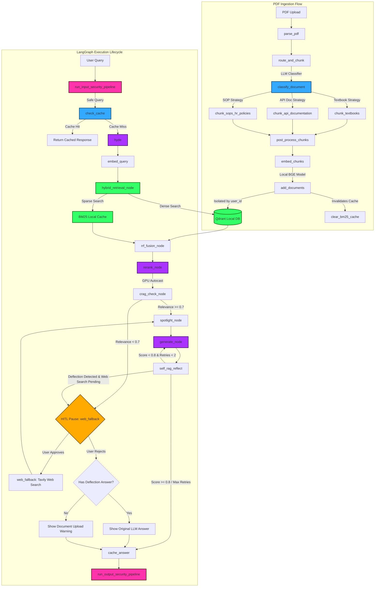

# ⚡ Enterprise RAG System Architecture Summary ⚡

Welcome to the comprehensive system documentation for the **Enterprise RAG System**. This document maps out every component, function, data flow, and caching pipeline, utilizing colors, emojis, and clear explanations.

---

## 🗺️ Mermaid Flowchart Diagram

Here is the complete dynamic request lifecycle showing how files, queries, and background processes flow through the system:



---

## 📂 File-Wise Function Mapping (with Hinglish Explanations)

This section maps all functions file-by-file with a detailed **Hinglish** translation of their operational roles:

### ⚙️ `config.py` — Settings and API Factories
*   **`get_llm_client()`**
    *   *Hinglish*: NVIDIA NIM server ke liye OpenAI client initialize karta hai jo `deepseek-ai/deepseek-v4-pro` model run karta hai.
*   **`get_embedding_client()`**
    *   *Hinglish*: Local embedding models (BGE) ke environment parameters load karta hai.

### 🔑 `auth.py` — Supabase Auth Guard
*   **`get_current_user(token)`**
    *   *Hinglish*: Incoming request se Bearer JWT token extract karta hai aur Supabase ke JWKS keys se decode karke `user_id` verify karta hai.

### 🛑 `rate_limiter.py` — Upstash Rate Limiter
*   **`rate_limit_dependency(user)`**
    *   *Hinglish*: `user_id` ke basis par Upstash Redis check karta hai. Agar Redis offline ho toh request ko pass hone deta hai (graceful degradation).

### 🛡️ `security.py` — Input/Output Guard Rails
*   **`run_input_security_pipeline(query)`**
    *   *Hinglish*: SQL Injection, Prompt Injection, toxicity, aur sensitive PII data check karta hai query ingest karne se pehle.
*   **`run_output_security_pipeline(response)`**
    *   *Hinglish*: Output response me se emails, phone numbers, and CC details mask/redact karta hai.

### 🧠 `cache.py` — Redis Two-Tier Cache Client
*   **`cache_key(prefix, text, user_id=None)`**
    *   *Hinglish*: Key structure generate karta hai (`rag:user_id:hash`). Single-tenant cache partition multi-tenant data leaks completely eliminate kar deta hai.
*   **`get_cached_embedding(text)` / `set_cached_embedding(...)`**
    *   *Hinglish*: Global embedding cache compute tokens save karta hai.
*   **`get_cached_answer(query, user_id)` / `set_cached_answer(...)`**
    *   *Hinglish*: Caches answers isolated strictly by `user_id` for 7 days.

### 📂 `ingestion.py` — Layout Ingestion Controller
*   **`parse_pdf(file, filename)`**
    *   *Hinglish*: PDF text stream parse karta hai `[PAGE_X]` labels inject karke.
*   **`post_process_chunks(chunks, combined_text)`**
    *   *Hinglish*: `[PAGE_X]` labels clean karta hai aur absolute page metadata coordinates match karta hai.
*   **`embed_chunks(chunks)`**
    *   *Hinglish*: Chunks ko `BAAI/bge-small-en-v1.5` local model se encode karwata hai GPU PyTorch FP16 support ke saath.

### 📝 `chunking_strategies.py` — Document-Aware Chunker Hub
*   **`classify_document(sample_text)`**
    *   *Hinglish*: Initial 1,500 chars LLM se classify karta hai: Textbooks, API documentation, ya SOP policies.
*   **`chunk_textbooks(...)`**: 10-15% sliding window overlap with LaTeX block isolation.
*   **`chunk_api_documentation(...)`**: Strict 0% overlap inside code blocks (` ``` `), 20% on prose text.
*   **`chunk_sops_hr_policies(...)`**: 10% overlap tied with metadata headers (`version`, `department_owner`).

### 🕸️ `rag_graph.py` — LangGraph Pipeline Engine
*   **`_is_deflection(answer)`**
    *   *Hinglish*: Check karta hai ki LLM ne refusal/deflection statement generate ki hai ya nahi (*"does not contain"*, *"no information about"*).
*   **`self_rag_reflect_node(state)`**
    *   *Hinglish*: Answer groundedness score calculate karta hai (0.0 to 1.0). Agar context off-topic hone ki wajah se LLM deflection statement deta hai, toh execution prompt status update karke HITL web search activate kar deta hai.
*   **`web_fallback_node(state)`**
    *   *Hinglish*: HITL pause node. Agar user search approve kare, toh Tavily search run karke web context fetch karta hai. Agar user reject kare, toh standard upload warning ya existing deflection answer show karta hai.
*   **`route_after_self_rag(state)`**
    *   *Hinglish*: Conditional edges handle karta hai. Agar `web_search_needed` flag active ho, toh standard flow interrupt karke `web_fallback` trigger karta hai.

### 🌐 `main.py` — FastAPI Interface Gateway
*   **`lifespan(app)`**: Initializes `PostgresSaver` checkpointer with `autocommit=True`.
*   **`resume_query(request, user)`**: Updates paused thread checkpoint state with `web_search_approved` feedback and resumes graph execution.

---

## 📡 API Routes Reference

| Endpoint | Method | Security / Auth | Input Payload | Output / Response |
| :--- | :--- | :--- | :--- | :--- |
| `/signup` | **POST** | Public | `{email, password}` | `{message: "Signup successful"}` |
| `/login` | **POST** | Public | `{email, password}` | `{access_token, token_type}` |
| `/documents` | **POST** | Bearer JWT + Rate Limit | Multipart Form: File `.pdf` | `{status, filename, pages, chunks, message}` |
| `/query` | **POST** | Bearer JWT + Rate Limit | `{query}` | `RAGResponse` (200 OK) OR `{"status": "paused", "thread_id"}` (202 Accepted) |
| `/query/resume` | **POST** | Bearer JWT + Rate Limit | `{thread_id, approve, query}` | `RAGResponse` (200 OK) |
| `/me` | **GET** | Bearer JWT | None | `{user_id, email, ...}` |
| `/documents/count` | **GET** | Bearer JWT + Rate Limit | None | `{documents_indexed}` |
| `/` | **GET** | Public | None | `{status: "healthy", document_count}` |

---

## 🔬 Chunking, Caching, and Vector Storage Frameworks

### 🧩 1. The Rectified Chunking Strategies
During document upload, the first 1,500 characters are parsed and analyzed by the **LLM Document Classifier** (`DeepSeek V4 Pro`) to dynamically route the document to the optimal parsing strategy:
1.  **Textbooks Strategy**:
    *   *Overlap*: **10% to 15% sliding window overlap** to ensure conceptual continuity across page breaks.
    *   *Formatting*: Protects LaTeX equations ($ and $$) and code blocks.
2.  **API & Technical Documentation Strategy**:
    *   *Overlap*: **Strict 0% overlap inside code blocks** to prevent syntax loop corruption. **20% overlap** is maintained for surrounding explanatory text to preserve variables context.
3.  **SOPs & HR Policies Strategy**:
    *   *Overlap*: **10% overlap** heavily tied to pre-retrieval metadata filters.

---

### 🚀 2. Two-Tier Upstash Caching
*   **Embedding Cache (Tier 2)**: Checks if the user query was previously embedded. Uses Upstash Redis key lookup (`emb:hash`). If hit, retrieves vector directly. If miss, calls local embedding models to generate the embedding, then saves to Redis with a **7-Day TTL**. Keeping this global saves computational tokens and execution time across all tenants.
*   **Answer Cache (Tier 1)**: Caches RAG answers isolated strictly by user (`rag:user_id:hash`). Saves final answers with a **7-Day TTL** (`604,800` seconds). Partitioning keys by `user_id` prevents **cross-user data leakage** and guarantees that tenants can never access cached answers generated from another user's documents.
*   *Security Note*: Fallback warnings and error notifications (e.g. *"You haven't embedded any documents yet..."* or *"NVIDIA NIM outage..."*) are **strictly excluded** from caching, preventing transient error states from locking out subsequent valid runs.

---

### 💾 3. Vector Storage & Isolation in Qdrant Local
*   **Data Isolation**: Every document chunk upserted carries a metadata field tracking the user's Supabase UUID (`user_id`).
*   **Query Filtering**: When calling Qdrant search, a pre-filter constraint is applied:
    ```python
    Filter(must=[FieldCondition(key="user_id", match=MatchValue(value=user_id))])
    ```
    This guarantees that users can **only** search, retrieve, or compile answers from documents that they personally uploaded.

---

## 💡 Interview Questions (Technical & Non-Technical)

### 💻 Technical Questions

#### Q1: How did you implement Human-in-the-Loop (HITL) web search confirmation in your RAG graph?
*   **Answer**: We compiled the LangGraph state machine with `interrupt_before=["web_fallback"]`. When local retrieval scores are below threshold ($<0.7$) or when Self-RAG detects an LLM deflection statement (*"the context does not contain..."*), the graph sets `web_search_needed = True` and pauses before `web_fallback`. FastAPI yields a `202 Accepted` status with the `thread_id`. The Streamlit UI displays confirmation buttons. When the user approves or rejects, `/query/resume` updates the active checkpoint state and resumes graph execution using `graph.invoke(None, config)`.

#### Q2: How do you prevent deflection/refusal statements from polluting your answer cache or causing infinite loops?
*   **Answer**: 
    1.  **Cache Guard**: In `cache_answer_node`, we inspect the output with `_is_deflection(answer)`. Any response matching deflection phrases (*"does not contain"*, *"no information about"*, etc.) or error fallbacks is **strictly excluded** from Upstash Redis caching.
    2.  **Loop Prevention**: When web search is approved (`web_search_approved = True`), `self_rag_reflect` skips deflection detection because web search is the last resort. This guarantees the graph finalizes and returns the grounded web answer without looping infinitely.

#### Q3: How is multi-tenancy and data security handled at the database level when documents are ingested and queried?
*   **Answer**: Multi-tenancy is handled via **payload metadata partitioning**. When a PDF is chunked and embedded, we link the user's decoded Supabase UUID (`user_id`) directly to the chunk payload in Qdrant. During query retrieval, we apply a strict Qdrant filter constraint: `Filter(must=[FieldCondition(key="user_id", match=MatchValue(value=user_id))])`. This isolates the vector space dynamically without requiring separate physical collections.

#### Q4: Why does psycopg3's default behavior cause failures in LangGraph Postgres checkpointer setup, and how did you resolve it?
*   **Answer**: By default, psycopg3 runs queries in implicit transactions (`autocommit=False`). However, LangGraph's `PostgresSaver.setup()` migrates tables using the `CREATE INDEX CONCURRENTLY` statement, which PostgreSQL strictly forbids running inside open transaction blocks. We resolved this by configuring the connection pool with `kwargs={"autocommit": True}` during lifespan startup, allowing migration indexing scripts to run successfully.

---

### 👥 Non-Technical & Product Questions

#### Q5: Why is it important to customize chunking strategies by document category (e.g. Textbooks vs. API docs) instead of using a single global character limit?
*   **Answer**: Different document types have completely different layout features. For textbooks, we need semantic continuity (keeping sections and formulas together using a sliding overlap). For API docs, breaking code syntax makes chunks useless; we need syntax-aware splitting with a strict 0% overlap inside code blocks. For SOPs, conditional branches rely on versioning and department tags for routing. Tailoring strategies maximizes chunk relevance, saving LLM tokens and reducing hallucinations.

#### Q6: If Upstash Redis rate limiting or caching goes down, how does your system handle the failure?
*   **Answer**: The system implements **Graceful Degradation**. All Redis operations (caching and rate limiting) are wrapped in try-except statements. If Upstash experiences a connection loss, the API logs a warning and allows the request to bypass the cache/limit and query the RAG graph directly, ensuring continuous service uptime for the end user.
