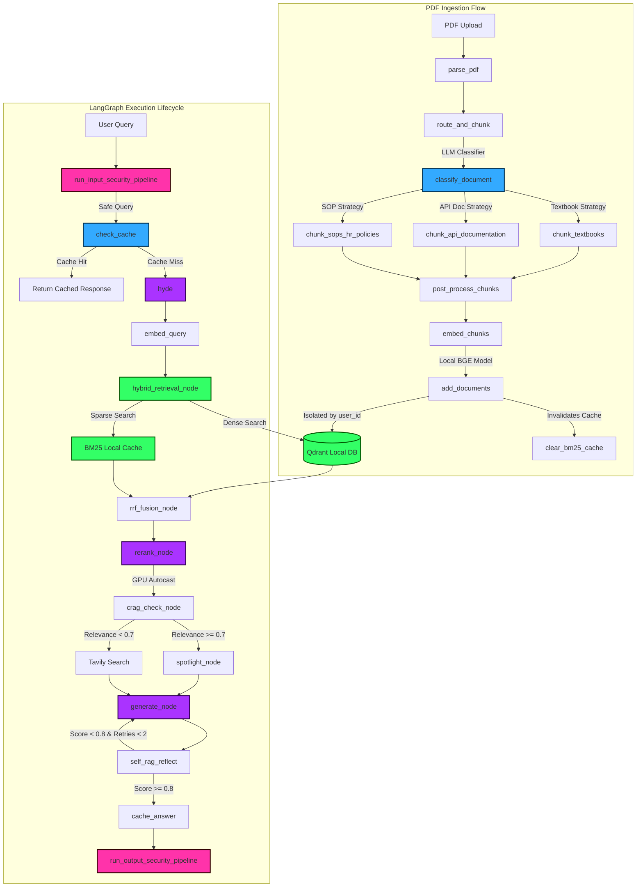

# ⚡ Enterprise RAG System Architecture Summary ⚡

Welcome to the comprehensive system documentation for the **Enterprise RAG System**. This document maps out every component, function, data flow, and caching pipeline, utilizing colors, emojis, and clear explanations.

---

## 🗺️ Mermaid Flowchart Diagram

Here is the complete dynamic request lifecycle showing how files, queries, and background processes flow through the system:



---

## 📂 File-Wise Function Mapping (with Hinglish Explanations)

This section maps all functions file-by-file with a detailed **Hinglish** translation of their operational roles:

### ⚙️ `config.py` — Settings and API Factories
*   **`get_llm_client()`**
    *   *Hinglish*: Yeh function NVIDIA NIM server ke liye OpenAI client initialize karta hai, jo deepseek-ai/deepseek-v4-pro model run karne ke kaam aata hai (jisme thinking mode disable kiya hua hai).
*   **`get_embedding_client()`**
    *   *Hinglish*: BGE local embedding models load karne se pehle variables load karta hai aur client instances manage karta hai.

### 🔑 `auth.py` — Supabase Auth Guard
*   **`get_current_user(token)`**
    *   *Hinglish*: Incoming HTTP Request se Bearer Token nikalta hai aur use Supabase ke dynamic public keys (JWKS) se verify karta hai. Agar token galat ya expire ho gaya ho, toh 401 Unauthorized exception raise kar deta hai.

### 🛑 `rate_limiter.py` — Upstash Rate Limiter
*   **`rate_limit_dependency(user)`**
    *   *Hinglish*: Supabase authenticated `user_id` ke basis par check karta hai ki user ne maximum allowance (e.g. 20 requests per minute) exceed toh nahi ki. Agar Redis offline ho, toh process graceful degrade karke pass kar deta hai taaki API crash na ho.

### 🛡️ `security.py` — Input/Output Guard Rails
*   **`run_input_security_pipeline(query)`**
    *   *Hinglish*: User ki query ko ingest karne se pehle SQL Injection, Prompt Injection, toxicity checks aur dynamic PII patterns (email, phones, credit cards) se filter karta hai. Query check fail hone par direct exit response deta hai.
*   **`run_output_security_pipeline(response)`**
    *   *Hinglish*: Final answer generate hone ke baad use review karta hai aur personal ya sensitive information leak (PII redacting) aur block keywords clean karta hai.

### 🧠 `cache.py` — Redis Two-Tier Cache Client
*   **`cache_key(prefix, text)`**
    *   *Hinglish*: Target text strings ko lowercase karke normalise karta hai aur safe storage ke liye SHA-256 hash code compute karta hai.
*   **`get_cached_embedding(text)` / `set_cached_embedding(...)`**
    *   *Hinglish*: Embeddings ko check aur write karne ke liye local and Upstash cache use karta hai taaki local vectors duplicate compute na karne padhein.
*   **`get_cached_answer(query)` / `set_cached_answer(...)`**
    *   *Hinglish*: Direct matched queries ke complete generated answers ko 7 days ke liye Upstash Redis caching me save karta hai.

### 📂 `ingestion.py` — Layout Ingestion Controller
*   **`parse_pdf(file, filename)`**
    *   *Hinglish*: Uploaded binary PDF stream ko temporary folder me write karke LlamaIndex PDFReader se extract karta hai taaki page numbering secure rahe.
*   **`post_process_chunks(chunks, combined_text)`**
    *   *Hinglish*: Document text me set page labels `[PAGE_X]` ke relative indices track karke absolute chunk coordinates find karta hai aur text me se un internal flags ko strip kar deta hai.
*   **`embed_chunks(chunks)`**
    *   *Hinglish*: Sub-chunks ko batch format me target local model se encode karwata hai (RTX GPU utilization se high speed processing).
*   **`ingest_pdf(file, filename, user_id)`**
    *   *Hinglish*: Full parsing flow assemble karta hai, router target check karta hai, vector output nikal kar Qdrant load store karta hai.

### 📝 `chunking_strategies.py` — Document-Aware Chunker Hub
*   **`classify_document(sample_text)`**
    *   *Hinglish*: PDF file ke initial characters read karke DeepSeek client se context match karta hai aur dynamic document configuration (Textbooks, API, SOPs) category select karta hai.
*   **`chunk_textbooks(...)`**
    *   *Hinglish*: Structural headings parse karta hai aur math formulas (LaTeX math formulas) ya source code blocks ko protect karke 10-15% context window sliding overlap maintain karta hai.
*   **`chunk_api_documentation(...)`**
    *   *Hinglish*: Explanatory prose sections ko 20% overlap provide karta hai aur code blocks ` ``` ` ya tables ko strict 0% overlap ke sath indivisible form me isolate karta hai.
*   **`chunk_sops_hr_policies(...)`**
    *   *Hinglish*: Policy templates read karke title/header se metadata (owner department, version updates) extract karta hai aur nodes ko 10% overlap density parameters par divide karta hai.
*   **`route_and_chunk(...)`**
    *   *Hinglish*: LLM layout response ke specific keyword logic par individual custom modules (`chunk_textbooks`, `chunk_api_documentation`, `chunk_sops_hr_policies`) fire kar deta hai.

### 🖥️ `models_local.py` — Local GPU Model Allocator
*   **`get_embedding_model()`**
    *   *Hinglish*: Local sequence encoder (`BAAI/bge-small-en-v1.5`) compile karta hai GPU execution device selection framework ke mutabik.
*   **`get_reranker_model()`**
    *   *Hinglish*: Sequence-based cross encoder models memory load karke predict calls serve karta hai.

### 🕸️ `rag_graph.py` — LangGraph Pipeline Engine
*   **`clear_bm25_cache(user_id)`**
    *   *Hinglish*: User ID cache maps clear karta hai jab koi user naya documentation update ya PDF upload kare, taaki BM25 corpus next search query par automatically refresh ho jaye.
*   **`hybrid_retrieval_node(state)`**
    *   *Hinglish*: Qdrant dense vector search (top 12 candidates) aur cache-driven tokenised BM25 search (top 12 candidates) run karta hai.
*   **`rerank_node(state)`**
    *   *Hinglish*: Fused search objects select karta hai aur Nvidia GPU tensor performance autocast (`torch.amp.autocast`) framework se fast scores calculate karta hai.
*   **`hyde(state)`**
    *   *Hinglish*: Original query parameters se related multiple hypothetical responses create karta hai query context enrich karne ke liye.
*   **`check_cache()`, `rrf_fusion_node()`, `crag_check_node()`, `spotlight_node()`, `generate_node()`, `self_rag_reflect()`, `cache_answer()`**
    *   *Hinglish*: Yeh sab workflow loops and validation nodes hain jo state management automate karte hain query resolution tak.

### 🌐 `main.py` — FastAPI Interface Gateway
*   **`FastAPI Global Exception Handler`**
    *   *Hinglish*: Global server blocks intercept karta hai aur raw tracebacks client screen par fail hone se block karke proper standard API formats handle karta hai.

### 📊 `ui.py` — Streamlit Interactive Frontend
*   *Hinglish*: State checks handle karke clean dashboard screen renders deta hai jis par trace logs metadata properties dikhayi deti hain.

---

## 📡 API Routes Reference

| Endpoint | Method | Security / Auth | Input Payload | Output / Response |
| :--- | :--- | :--- | :--- | :--- |
| `/signup` | **POST** | Public | `{email, password}` | `{message: "Signup successful"}` |
| `/login` | **POST** | Public | `{email, password}` | `{access_token, token_type}` |
| `/documents` | **POST** | Bearer JWT + Rate Limit | Multipart Form: File `.pdf` | `{status, filename, pages, chunks, message}` |
| `/query` | **POST** | Bearer JWT + Rate Limit | `{query}` | `{answer, citations: [{filename, page_number}], response_time_ms}` |
| `/me` | **GET** | Bearer JWT | None | `{user_id, email, ...}` |
| `/documents/count` | **GET** | Bearer JWT + Rate Limit | None | `{documents_indexed}` |
| `/` | **GET** | Public | None | `{status: "healthy", document_count}` |

---

## 🔬 Chunking, Caching, and Vector Storage Frameworks

### 🧩 1. The Rectified Chunking Strategies

During document upload, the first 1,500 characters are parsed and analyzed by the **LLM Document Classifier** (`DeepSeek V4 Pro`) to dynamically route the document to the optimal parsing strategy:

1.  **Textbooks Strategy**: 
    *   *Design*: Focuses on preserving continuous chapters and academic formulations.
    *   *Formatting*: Isolates LaTeX inline/block equations ($ and $$) and code blocks.
    *   *Overlap*: **10% to 15% sliding window overlap** is dynamically calculated to ensure conceptual continuity across page breaks.
2.  **API & Technical Documentation Strategy**:
    *   *Design*: Focuses on protecting dense syntax, parameter mappings, and scripts.
    *   *Formatting*: Sets exact chunk boundaries at markdown code blocks (```) and table tags.
    *   *Overlap*: **Strict 0% overlap inside code blocks** to prevent syntax loop corruption. **20% overlap** is maintained for surrounding explanatory text to preserve variables and parameters context.
3.  **SOPs & HR Policies Strategy**:
    *   *Design*: Solves intense cross-references and conditional parameters ("If X, then Y").
    *   *Formatting*: Extracts structural variables (`version`, `last_updated`, `department_owner`) from headings using LLM assistance.
    *   *Overlap*: **Tight 10% overlap** (300 token sizes, 30 overlap) heavily tied to pre-retrieval metadata filters.

---

### 🚀 2. Two-Tier Upstash Caching

```
User Query ──> [ Tier 1: Answer Cache ] (7-Day TTL Hit) ──> Return Response
                    │ (Miss)
                    └──> [ Tier 2: Embedding Cache ] (7-Day TTL Hit) ──> Qdrant Retrieval
```

*   **Embedding Cache (Tier 2)**: Checks if the user query was previously embedded. Uses Upstash Redis key lookup (`emb:hash`). If hit, retrieves vector directly. If miss, calls local embedding models to generate the embedding, then saves to Redis with a **7-Day TTL**. Keeping this global saves computational tokens and execution time across all tenants.
*   **Answer Cache (Tier 1)**: Caches RAG answers isolated strictly by user (`rag:user_id:hash`). Saves final answers with a **7-Day TTL** (`604,800` seconds). Partitioning keys by `user_id` prevents **cross-user data leakage** and guarantees that tenants can never access cached answers generated from another user's documents.

---

### 💾 3. Vector Storage & Isolation in Qdrant Local

*   **Embeddings Generation**: Computed locally on the **NVIDIA GeForce RTX 3060 Laptop GPU** using the 384-dimensional `BAAI/bge-small-en-v1.5` model.
*   **Data Isolation**: Every document chunk upserted carries a metadata field tracking the user's Supabase UUID (`user_id`).
*   **Query Filtering**: When calling Qdrant search, a pre-filter constraint is applied:
    ```python
    Filter(must=[FieldCondition(key="user_id", match=MatchValue(value=user_id))])
    ```
    This guarantees that users can **only** search, retrieve, or compile answers from documents that they personally uploaded.

---

## 💡 Interview Questions (Technical & Non-Technical)

### 💻 Technical Questions

#### Q1: Reranking pipelines are highly effective but represent a massive latency bottleneck. How did you optimize this in your RAG graph?
*   **Answer**: We optimized this bottleneck using three strategies:
    1.  **PyTorch Autocast (Mixed-Precision)**: Wrapped Cross-Encoder scoring in a `torch.amp.autocast(device_type="cuda", dtype=torch.float16)` block on the RTX 3060, speeding up forward inference passes by 2x.
    2.  **Optimized Retrieval K**: Reduced dense and sparse retrieval targets from 20 to 12. Reranking 24 candidates instead of 40 saved 40% of Cross-Encoder model processing time.
    3.  **Candidate Batching**: Grouped candidate scoring batches directly inside Cross-Encoder `predict(pairs, batch_size=32)` calls to maximize GPU parallel utilization.

#### Q2: How is multi-tenancy and data security handled at the database level when documents are ingested and queried?
*   **Answer**: Multi-tenancy is handled via **payload metadata partitioning**. When a PDF is chunked and embedded, we link the user's decoded Supabase UUID (`user_id`) directly to the chunk payload in Qdrant. During query retrieval, we apply a strict Qdrant filter constraint: `Filter(must=[FieldCondition(key="user_id", match=MatchValue(value=user_id))])`. This isolates the vector space dynamically without requiring separate physical collections.

#### Q3: Why does compiling the BM25 sparse index on-the-fly cause latency issues in production, and how did you resolve it?
*   **Answer**: Fetching all documents from the database and tokenizing/building the BM25 index on every single query causes $O(N)$ query latency scaling with database size. We resolved this by building an **in-memory BM25 Cache** mapped per `user_id`. When a user uploads a new PDF, the upload endpoint invalidates their cache. On subsequent query hits, the precompiled BM25 search index is re-used, reducing BM25 search latency from seconds to milliseconds.

---

### 👥 Non-Technical & Product Questions

#### Q4: Why is it important to customize chunking strategies by document category (e.g. Textbooks vs. API docs) instead of using a single global character limit?
*   **Answer**: Different document types have completely different layout features. For textbooks, we need semantic continuity (keeping sections and formulas together using a sliding overlap). For API docs, breaking code syntax makes chunks useless; we need syntax-aware splitting with a strict 0% overlap inside code blocks. For SOPs, conditional branches rely on versioning and department tags for routing. Tailoring strategies maximizes chunk relevance, saving LLM tokens and reducing hallucinations.

#### Q5: If Upstash Redis rate limiting or caching goes down, how does your system handle the failure?
*   **Answer**: The system implements **Graceful Degradation**. All Redis operations (caching and rate limiting) are wrapped in try-except statements. If Upstash experiences a connection loss, the API logs a warning and allows the request to bypass the cache/limit and query the system directly, ensuring continuous uptime for the end user.
